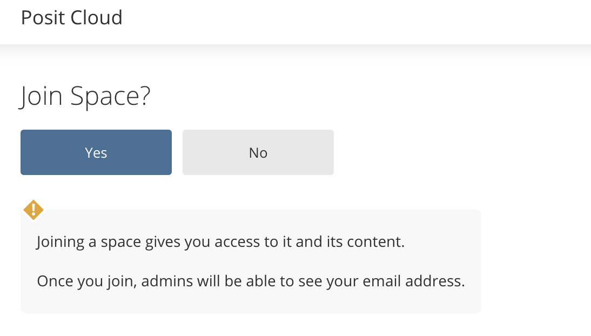
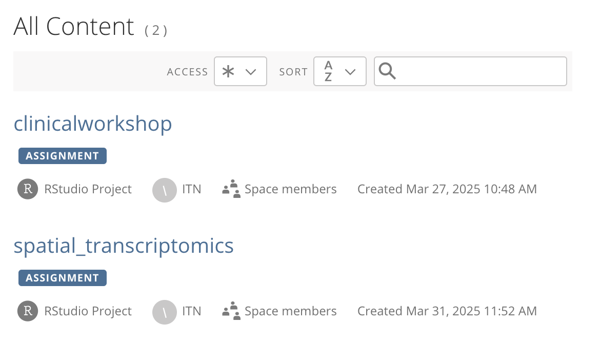
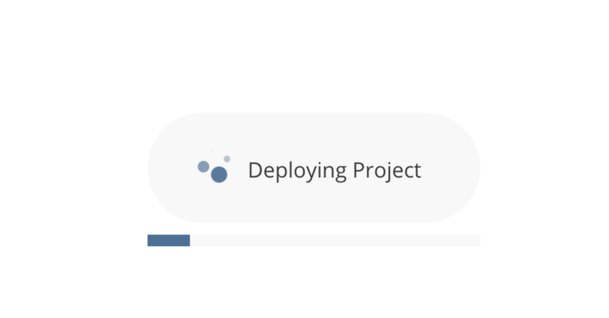
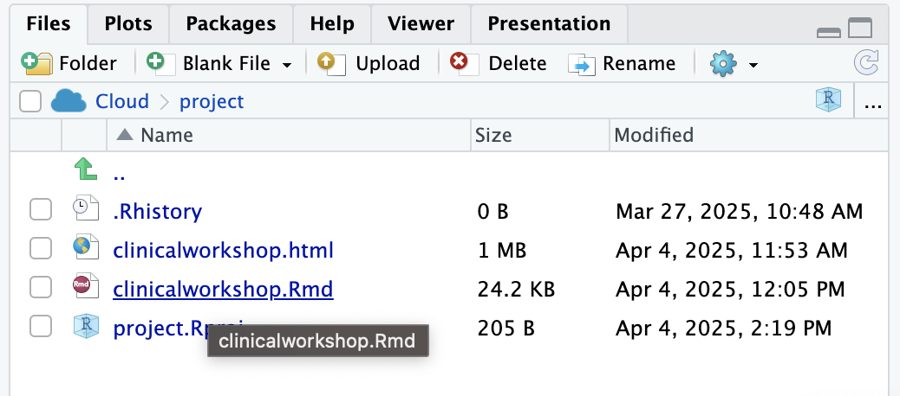
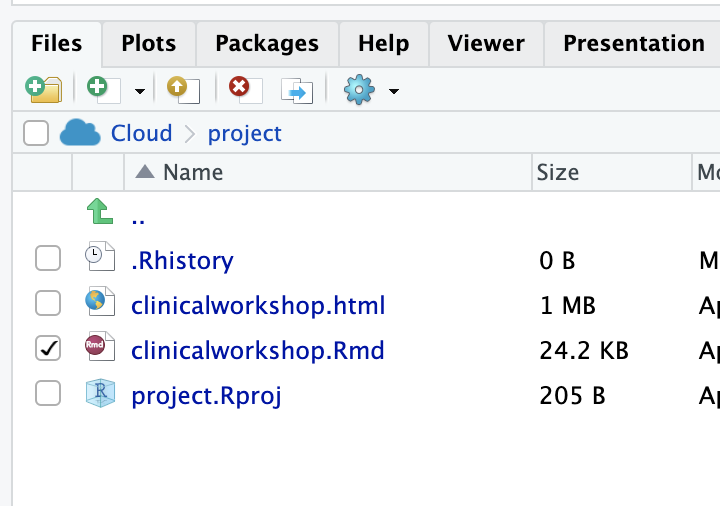
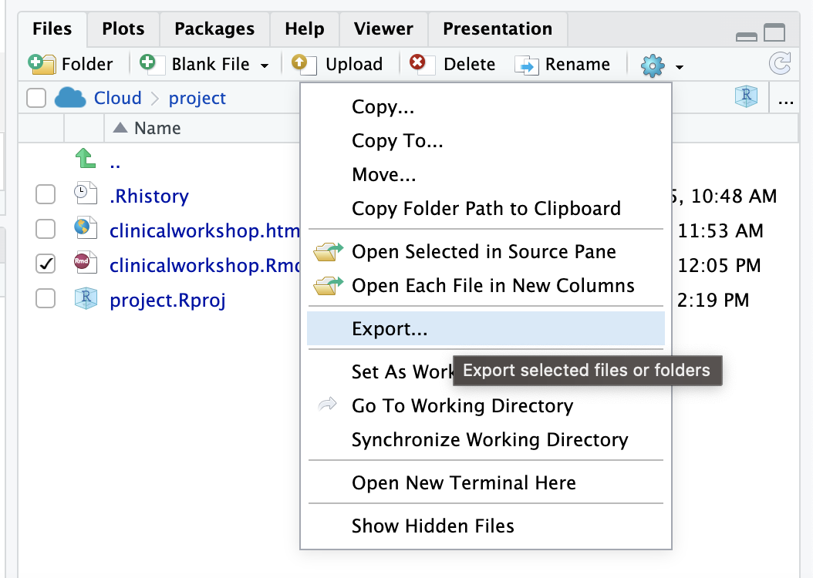
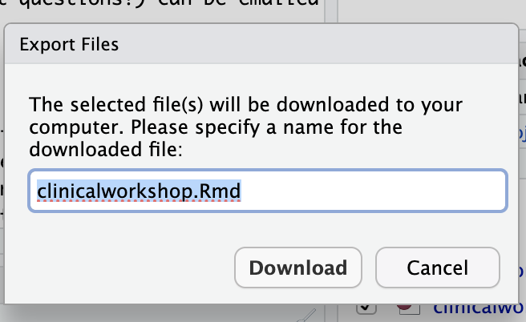
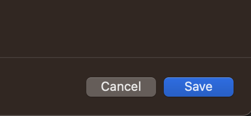

## Activity: Set Up Posit Cloud

For easy start up we will use Posit Cloud -- an online resource for using R.

If you have not already...

<input type="checkbox"> Create an account (if needed).  
<input type="checkbox"> Log into Posit.Cloud (if needed).  
<input type="checkbox"> Click on the Posit Cloud that was sent to the email address you used to register for the workshop.    

When you click on the link you will see this:

    

<input type="checkbox"> Click `Yes` to enter the workspace.    

    

<input type="checkbox"> Select the appropriate project for your workshop. This will take some time.    

    

<input type="checkbox"> Click on the `.Rmd` file to open it.  

    

<input type="checkbox"> Now follow along with each step in the file by clicking the green triangles at the top right of each code chunk (gray boxes).

**It is very important that you run each step in the order given for the code to work!**

<input type="checkbox"> For this notebook, as you save the `clinicalworkshop.Rmd`, the output is saved as a snapshot in the `html` file. Click on this `html` file and choose "View in web browser"  

## Bonus: To run on your own computer

We will keep the Posit Cloud account available to you for one week after the workshop. Please download any of your files you'd like to keep before this week is up!

If you'd like to run this on your own computer you will need to have R and an environment like RStudio. You can follow this [installation guide](https://jhudatascience.org/intro_to_r/modules/Setup/Setup.html) if you need help.

<input type="checkbox"> Download the Rmd by clicking the checkmark next to the Rmd file name.  

    

<input type="checkbox"> Then click on the gear and choose "Export".  

    

<input type="checkbox"> Confirm that you wish to download the file.  

    

<input type="checkbox"> Click save in the popup after you identify where you would like to save your file.  

    

