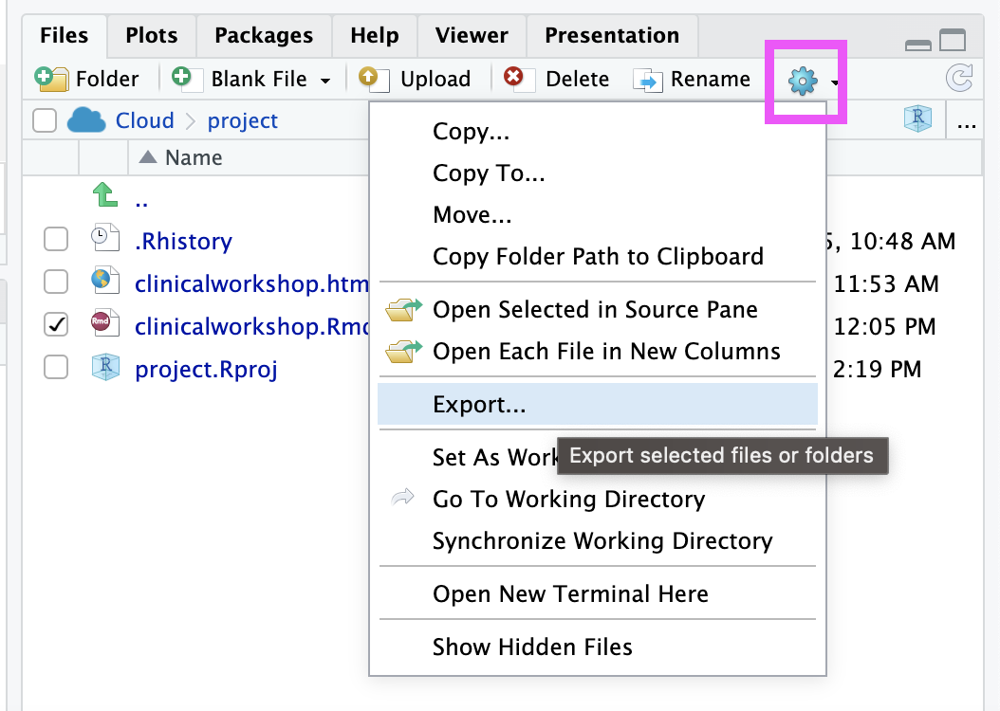

## Activity: Set Up Posit Cloud

For easy start up we will use Posit Cloud -- an online resource for using R.

<input type="checkbox"> If you have not already, accept the invite to our Posit Cloud. The link was sent to the email address you used to register for the workshop.    

- The email will look like this:  
- > 
______ has invited you to join Posit Cloud. By clicking on the link below, you can join the space that has been shared with you. Note that you will first be prompted to create an Posit Cloud account.

<input type="checkbox"> Create an account (if needed).  
<input type="checkbox"> Log into Posit.Cloud (if needed).  
<input type="checkbox"> Get a copy of this workspace https://posit.cloud/spaces/604196/content/9588231.   
<input type="checkbox"> Name your copy of the workspace by typing in on the title at the top and open the file called `clinicalworkshop.Rmd`.   

    

<input type="checkbox">  One of the early steps in the code will ask you `.cache/R/ExperimentHub does not exist, create directory? (yes/no)`. Type in "yes" and hit Enter. You should only have to do this once.  

<input type="checkbox"> Now follow along with each step in the notebook by clicking the green triangles at the top right of each code chunk.

**It is very important that you run each step in the order given for the code to work!**

<input type="checkbox"> For this notebook, as you save the `clinicalworkshop.Rmd`, the output is saved as a snapshot in the `nb.html` file. Click on this `nb.html` file and choose "View in web browser"  

## Bonus: To run on your own computer

We will keep the Posit Cloud account available to you for one week after the workshop. Please download any of your files you'd like to keep before this week is up!

If you'd like to run this on your own computer you will need to have R and an environment like RStudio. You can follow this [installation guide](https://jhudatascience.org/intro_to_r/modules/Setup/Setup.html) if you need help.

<input type="checkbox"> Download the Rmd by clicking the checkmark next to the Rmd file name.  
<input type="checkbox"> Then click on the gear and choose "Export".  

