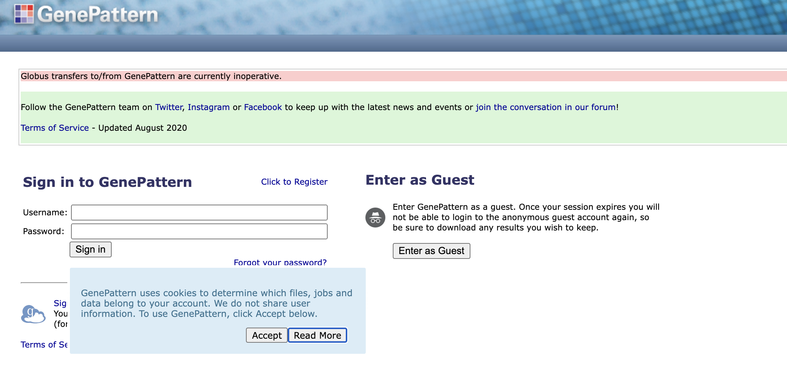
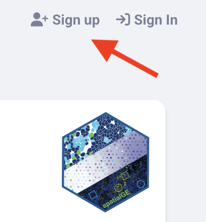

# University of Michigan ITN Workshops

Welcome to the ITN University of Michigan Workshop Series!

Over the next two days we will cover the a variety of bioinformatics topics. Please feel free to refer to these materials in the future.

**Wi-Fi:** Please use the guest network and supply your email.

**Website:** https://bit.ly/umich_itn

### **Schedule**

| Day 1 (NCRC Building 10 South Atrium) - April 8:                                           | Time                   |  
|---------------------------------------------------------------------------|:----------------------:|
| Introduction to Reproducibility                                           | 9:30 AM - 11:00 AM     |  
| Intermediate and Advanced Reproducibility                                 | 11:30 AM - 1:00 PM     |  
| <mark>Free Lunch!</mark>| 1:00 PM - 2:00 PM      |  
| Analyzing Clinical Data                                                   | 2:00 PM - 3:30 PM      |

| Day 2 (NCRC Building 10 South Atrium) - April 9:                                           |  Time                  |
|---------------------------------------------------------------------------|:----------------------:|
| Choosing Genomics Tools                                                   | 9:30 AM -11:00 AM      |  
| Tools for Spatial Transcriptomics                                         | 11:30AM - 1:00 PM      |
| <mark>Free Lunch!</mark>| 1:00 PM - 2:00 PM      |
| Introduction to UM Resources                                              | 2:00 PM - 3:00 PM      |

 

### **Pre-requisites**

This information was emailed to you, but you will need to register for the following resources based on the workshops you will be attending:

| Day 1 Workshops | GitHub | GitHub Desktop | Docker Desktop | PositCloud |
|----------|:------:|:--------------:|:--------------:|:----------:|
| Introduction to Reproducibility | `r  config::get("checkmark")` | `r  config::get("checkmark")` |  |  |
| Intermediate and Advanced Reproducibility | `r  config::get("checkmark")` | `r  config::get("checkmark")` | `r  config::get("checkmark")` |  |
| Analyzing Clinical Data |  |  |  | `r  config::get("checkmark")` |

| Day 2 Workshops |  GenePattern | spatialGE |
|-----------------|:------------:|:---------:|
| Choosing Genomics Tools | `r  config::get("checkmark")` |   |
| Tools for Spatial Transcriptomics|  | `r  config::get("checkmark")`|

 

If you do not have a **GitHub account** or a preferred git client, please create your own GitHub account and install **GitHub Desktop**:
  - [Create a GitHub account](https://github.com/) using the "Sign up" button in the top right.
  - [Download GitHub Desktop](https://desktop.github.com/download/)

Install **Docker and Docker Desktop** if you don’t already have it installed by [following these instructions](https://www.docker.com/get-started/) *(If you absolutely cannot install Docker you can try to [install Podman as an alternative](https://podman.io/docs/installation))*

To create a **Posit Cloud** account, go to the [Posit Cloud website](https://login.posit.cloud/register?redirect=https%3A%2F%2Fclient.login.posit.cloud%2Foauth%2Flogin%3Fshow_auth%3D0%26show_login%3D0) and sign up with any of the shown methods.

To create a **GenePattern** account, go to the [GenePattern website](https://cloud.genepattern.org/gp/) and click the "Click to Register" link above the login prompt.

    

To create a **spatialGE** account, go to [spatialGE Website](https://spatialge.moffitt.org) and click on "Sign Up" in the upper right corner.

    

<!--
### Accessing Computational Resources for further practice or your research after the workshop

- **Galaxy**: The training link will no longer work, and you should use [usegalaxy.org](https://usegalaxy.org/) to access the platform.
- **Posit Cloud**: The workspace will be available until {FILL IN DATE}, otherwise, you could use the free version of PositCloud [https://posit.cloud/](https://posit.cloud/) to work with R in general (but does not have enough computing capacity to work with the data we used in our workshop). Alternatively, you could R/RStudio on your local machine or potentially on your institutional server.
- **GenePattern**:
- **spatialGE**: You can continue using the link [https://spatialge.moffitt.org/](https://spatialge.moffitt.org/) and can also use the R package: [https://github.com/FridleyLab/spatialGE](https://github.com/FridleyLab/spatialGE)
-->
